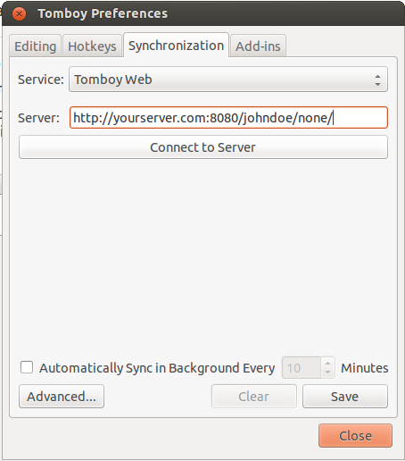

Build and run Rainy
===================

### 0. Install requirements:
  * mono
  * sqlite3 (usually no need to install this, as it comes with most distros by default)
  
On a debian/ubuntu based system, you could install the above requirements with:

	sudo apt-get install git mono-complete libsqlite3-0

ATTENTION: It is advised to install the `mono-complete` or similiar meta-package on your linux distro to avoid missing libraries exceptions

When building from source also install:

  * automake / autotools
  * git

```
	sudo apt-get install build-essential automake git
```

### 1a. Using a binary release

Fetch the latest release from <http://rainy.notesync.org/release/>. Unzip the file, then go to step 2.

### 1b. Building from source: 

	git clone https://github.com/Dynalon/Rainy.git

	# will fetch any deps and compile rainy from source result will be compiled
	# into ./release/Rainy.exe single packed .exe that can be run with mono
	make

	# OPTIONAL: create a single, statically linked bundle for easy deployment
	# which required no other dependencies except sqlite3 (so no mono is required
	# to run, but executable will not be plattform independent).
	# The executable can then be found in ./release/linux/
	make linux_bundle 

### 2. Edit settings.conf

There is a sample settings.conf which needs to be edited, i.e. change username/password and set the `DataPath`, which will tell Rainy where to store your notes. _Double check_ your settings.conf is valid JSON (besides the comment lines and the missing quotes for keys). Pay special attention not to have any invalid value delimiters (like a comma) in place where it does not belong.

### 3. Start Rainy

	mono Rainy.exe -c settings.conf

If you want more verbose output (helpfull when supplying bug reports), you can change the loglevel by supplying the `-vvvv` parameter:

	mono --debug Rainy.exe -c settings.conf -vvvv

is no daemon mode, but you can use and install `screen` on linux to run rainy in the background:

	screen mono Rainy.exe -c settings.conf

After you have started a screen session, you may detach it by typing `CTRL+A`, then `CTRL+D`.

Alternately, if you want to start Rainy on startup in detached mode, you can use:

	screen -X rainy-session -d -m mono 'Rainy.exe -c settings.conf'

or use `mono-service`:

	mono-service Rainy.exe -c settings.conf 

### 4. First sync in Tomboy

Now open up Tomboy (or another client, like [Tomdroid][tomdroid]), and point the synchronisation url to Rainy:

	https://yourserver.com:8080/<username>/<password>/

For the default settings.conf, there is a user `johndoe` with password set to `none`. In this case the example url would be:

	https://yourserver.com:8080/johndoe/none/

Click "Connect to server"; a browser instance should fire up and telling you immediatelly that the Tomboy authorization was successfull. You can now close the browser and start the first sync in Tomboy.



### 5. A word of warning & disclaimer

**Rainy is currently in beta quality and not meant for production use, but for testing and development only. If you lose notes, don't blame me or any of the developers, you've been warned. Additionally, HTTPS is currently not supported - you will not want to sync your notes in a foreign network environment where someone can sniff your authentication data or note content.**

### 6. Known issues

There are currently some issues in Tomboy and Tomdroid that you should know of before using Rainy.

* Tomboy
  * There is a [bug in Tomboy][tomboy-bug-1] regarding note templates, especially the "New Note Template" note that will always reappear and cause conflicts. If you happen to get a window in Tomboy telling you that a note with the title "New Note Template" already exists, choose to *rename the local note version*. **Do not chose overwrite the local note!**. The renamed note must be kept and not deleted.

* Tomdroid
  * Do not use the Tomdroid version that is in the Google Play market, it is way to old and syncing will __not__ work
  * Instead use at least version 0.7.2 from the [Tomdroid website][tomdroid]
  * __upon first sync with Tomdroid you will lose all notes stored in Tomdroid, so backup them first!__. This is an open Tomdroid issue.
  * Due to [another bug][tomdroid-bug-2], the first time you sync in Tomdroid might not show any notes. Just create more notes in *Tomboy* and do multiple syncs. Then sync Tomdroid.

  [tomdroid]: https://launchpad.net/tomdroid
  [tomboy-bug-1]: https://bugzilla.gnome.org/show_bug.cgi?id=665679
  [tomdroid-bug-1]: https://bugs.launchpad.net/tomdroid/+bug/1074602
  [tomdroid-bug-2]: https://bugs.launchpad.net/tomdroid/+bug/1074676
